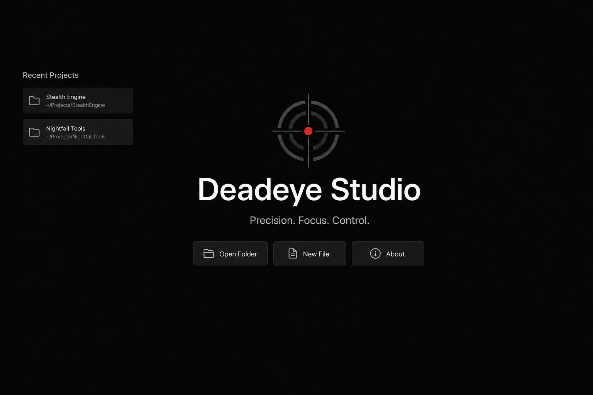
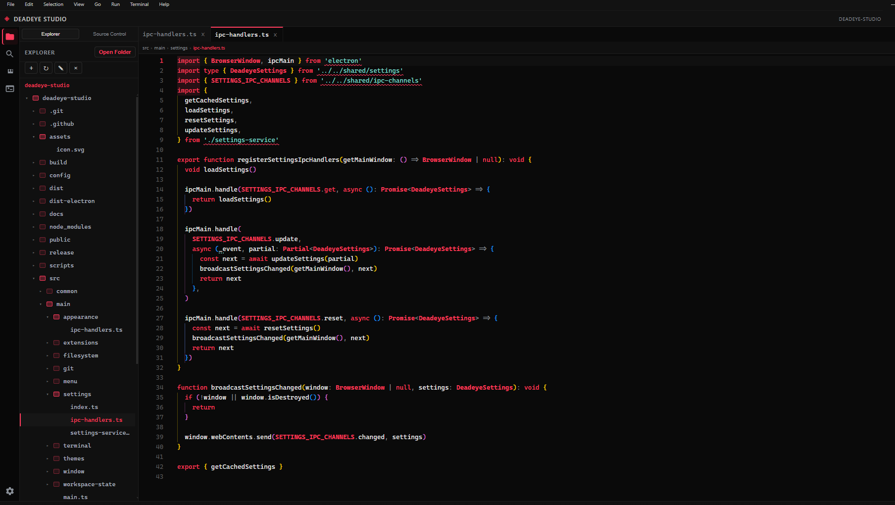
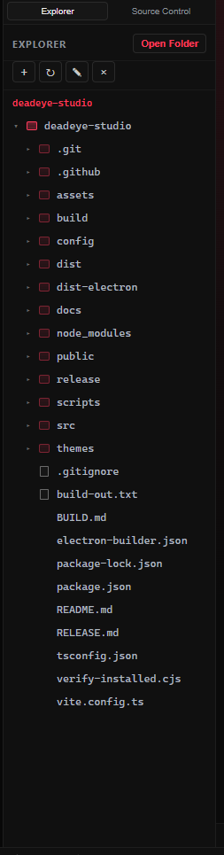
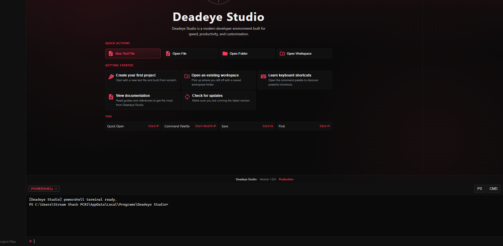
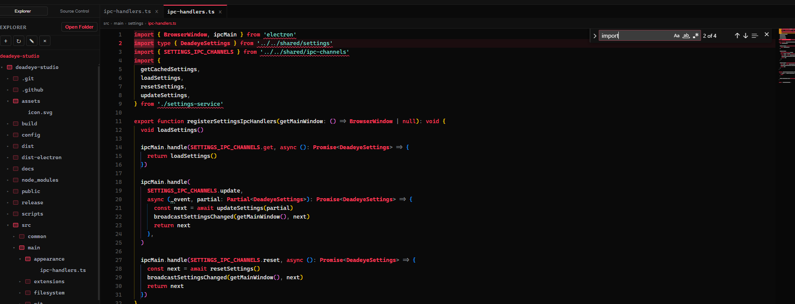
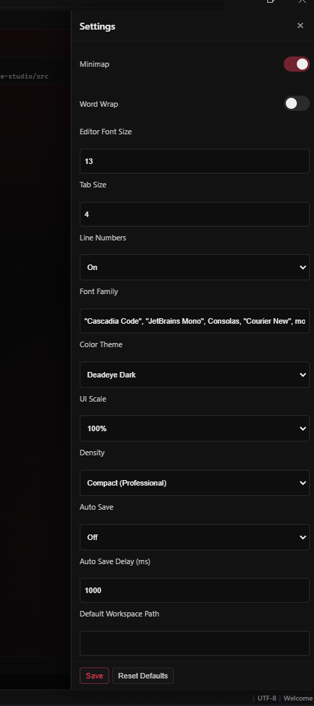

# Deadeye Studio

**Precision. Focus. Control.**

Deadeye Studio is a professional desktop code editor built with Electron and the Monaco editor. It delivers a focused editing experience with a polished dark interface, integrated terminal, Git tooling, and broad language support — without the complexity of a full IDE platform.



## Features

- **Monaco-powered editing** — syntax highlighting, semantic tokens (TypeScript/JavaScript), bracket matching, and language-aware indentation
- **File explorer** — open folders, create/rename/delete files, type-specific file icons
- **Tabbed workspace** — multiple documents, session recovery, recent projects
- **Quick Open & Go to Line** — fast navigation across large projects
- **Integrated terminal** — shell sessions in the editor layout
- **Git integration** — source control panel, diff viewer, commit workflow
- **Settings** — editor font, tab size, theme, and workspace preferences persisted to `~/.deadeye/settings.json`
- **Command palette** — discoverable keyboard-driven commands
- **Welcome screen** — open folder, new file, recent projects
- **Secure architecture** — sandboxed renderer, context-isolated preload, filesystem protections in the main process

## Supported languages

Deadeye Studio registers languages centrally and maps them to Monaco modes, theme rules, and file icons.

| Category | Languages |
|----------|-----------|
| Systems | C, C++, Rust, Go |
| Application | C#, Java, Python, Lua |
| Web | HTML, CSS, SCSS, Less, JavaScript, TypeScript |
| Data & config | JSON, XML, YAML, TOML |
| Shell | Bash/Shell, PowerShell, Batch |
| Shaders | GLSL, HLSL |
| Other | SQL, Markdown, Dockerfile, Plain text |

TypeScript and JavaScript include enhanced semantic highlighting via the Deadeye Dark theme.

## Screenshots

| Welcome | Editor |
|---------|--------|
|  |  |

| Explorer | Terminal |
|----------|----------|
|  |  |

| Find in editor | Settings |
|----------------|----------|
|  |  |

Screenshots captured from **Deadeye Studio v1.0.0** (production build).

## Installation

### Download (recommended)

Get the latest release from [GitHub Releases](https://github.com/Deadeye3240/Deadeye-Studios/releases/latest):

| Platform | Artifact | Description |
|----------|----------|-------------|
| Windows | `Deadeye-Studio-1.0.0-Setup.exe` | NSIS installer with Start Menu and desktop shortcuts |
| Windows | `Deadeye-Studio-1.0.0-Portable.exe` | Portable executable — no installation required |
| Linux | `Deadeye-Studio-1.0.0-x86_64.AppImage` | AppImage — make executable and run (`chmod +x`) |
| Linux | `Deadeye-Studio-1.0.0-amd64.deb` | Debian/Ubuntu package (`sudo dpkg -i …`) |

Windows builds are unsigned; SmartScreen may warn on first launch.

### Run from source (development)

```bash
git clone https://github.com/Deadeye3240/Deadeye-Studios.git
cd Deadeye-Studios
npm install
npm run dev
```

### Run production build locally

```bash
npm run build
npm start
```

## Development

### Requirements

- Node.js 20+
- npm 10+
- Windows 10/11 or Linux (x64)

### Scripts

| Command | Description |
|---------|-------------|
| `npm run dev` | Start Vite dev server + Electron |
| `npm run build` | Production build (renderer + main + preload) |
| `npm run typecheck` | TypeScript validation |
| `npm start` | Launch Electron against the last build |
| `npm run dist` | Build + Windows NSIS installer and portable `.exe` |
| `npm run dist:win` | Windows installer + portable only |
| `npm run dist:linux` | Linux AppImage + `.deb` (best on Linux) |
| `npm run dist:installer` | Windows NSIS installer only |
| `npm run dist:portable` | Windows portable executable only |

### Project structure

```
src/
  main/          Electron main process (IPC, filesystem, Git, settings)
  preload.ts     Context bridge API
  renderer/      UI, Monaco editor, panels, welcome screen
  shared/        Types, language registry, version
dist/
  renderer/      Built renderer assets
dist-electron/   Built main + preload
release/         Packaged installers and portable builds
```

### Building on Windows

**Important:** Avoid `#` characters in the project path or user profile folder. Vite and esbuild treat `#` as a URL fragment, which breaks file resolution on Windows.

- **Recommended:** clone or copy the project to a short path such as `C:\dev\deadeye-studio`
- **Alternative:** `npm run build` uses `scripts/safe-build.mjs`, which stages to `C:\deadeye-studio-build` when `#` is detected in the path

See [BUILD.md](BUILD.md) for packaging notes and documented build warnings.

## License

MIT — Copyright © Deadeye Studio
